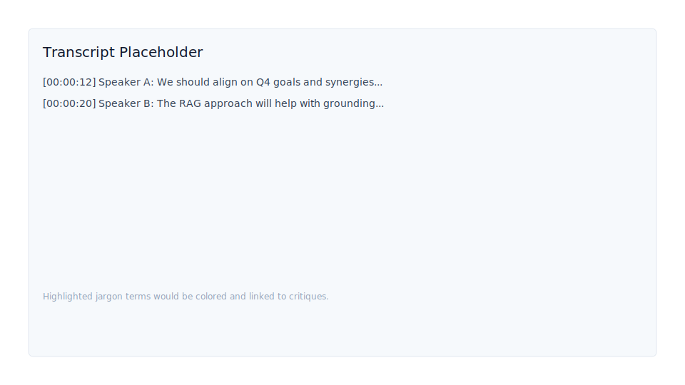
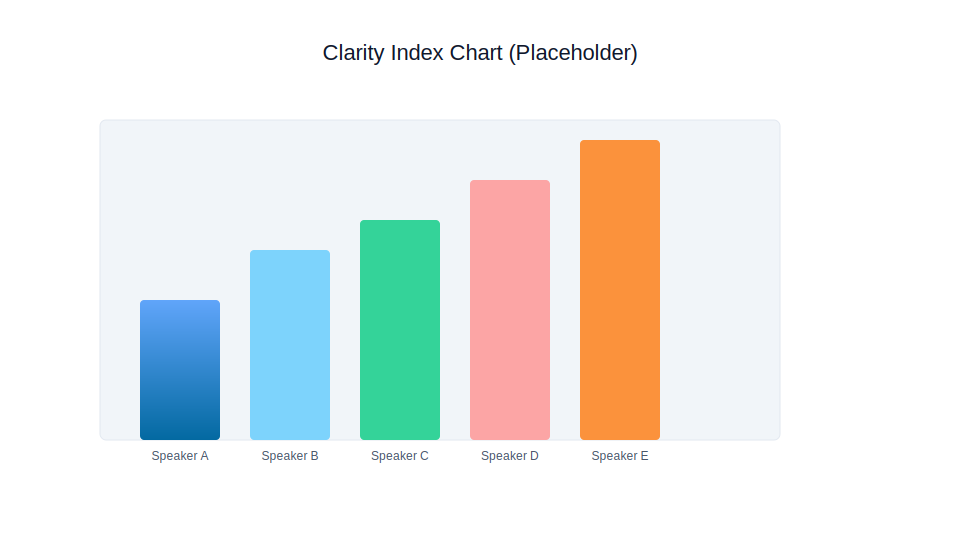

# 🗣️ Meeting Clarity Agent — Multimodal Communication Analyzer

**Timeline:** 5-Day Placement Project | **Focus:** LLM Structured Output & Agentic Workflow | **Status:** MVP (Complete)

Recent Updates
--------------
- **2025-12-03**: Reformatted `README.md` for clarity and structure.
- **2025-12-03**: Created a backup copy at `README.md.bak`.
- **2025-12-03**: Added Install & Run instructions, `Files of interest`, and Presentation Talking Points.
- **2025-12-03**: Suggested next steps (add `CONTRIBUTING.md`/`USAGE.md`, update `requirements.txt`, or add screenshots).

Overview
--------

This project implements an AI agent that measures and improves communication clarity in professional video meetings. It combines high-fidelity ASR (Automatic Speech Recognition) with Large Language Model (LLM) semantic analysis to produce a quantitative Meeting Clarity Index that highlights ambiguous language and jargon.

Key Features
------------
- **Weighted Clarity Index:** Computes a 0–100 score. The LLM assigns a penalty weight (0.0–1.0) to each jargon term based on ambiguity and severity.
- **Per-Speaker Contribution Analysis:** Uses ASR speaker diarization to show who contributed the most jargon.
- **Structured Output & Auditing:** Enforces a Pydantic schema for the LLM (Gemini) responses to output machine-readable JSON reports (jargon, weights, critiques).
- **Highlighting & Review:** Pins every identified jargon term in the full transcript for visual review in the Streamlit dashboard.

Architecture & Flow
-------------------
Pipeline triggered by a video upload:

- **Ingestion & Pre-processing (MoviePy):** Extracts audio, validates duration, and ensures FFmpeg is available (path configured in `src/utils.py`).
- **ASR Layer (AssemblyAI):** Produces transcription and speaker diarization.
- **LLM Semantic Analysis (Gemini / Mistral / Ollama):** Performs jargon identification, assigns weights, and generates critiques. Supports switching between cloud (Gemini) and local (Ollama + RAG) engines.
- **Presentation (Streamlit):** Dashboard with the Clarity Index, per-speaker charts, highlighted transcripts, and downloadable JSON reports.

Setup & Installation
--------------------

Prerequisites

- Python 3.9+ (use a virtual environment)
- FFmpeg installed and the executable path configured in `src/utils.py`
- API keys in a `.env` file: AssemblyAI (for ASR) and Gemini (for cloud LLM). If using Ollama, run the local Ollama server instead of Gemini.

Install dependencies (venv active):

```powershell
pip install -r requirements.txt
# or, if you prefer a single-line explicit install:
pip install streamlit moviepy assemblyai google-genai pandas python-dotenv pydantic tabulate ollama
```

Run the application:

```powershell
streamlit run app.py
```

Files of interest
-----------------
- `app.py` — Streamlit launcher and UI
- `src/` — Core modules: `asr_processor.py`, `vision_processor.py`, `llm_analyser.py`, `utils.py`, `models.py`
- `data/jargon_master_list.csv` — Jargon grounding dataset

Screenshots
-----------
Here are example screenshots (placeholders) demonstrating the dashboard, transcript highlighting, and the Clarity Index chart. Replace these with real screenshots (PNG/SVG) when available.

- Dashboard: 
- Transcript + Highlights: 
- Clarity Index Chart: 

Presentation Talking Points
---------------------------
- **The Problem:** Ambiguous language and jargon reduce efficiency and cause misinterpretation.
- **The Solution:** A quantifiable Clarity Index that identifies problematic language and suggests improvements.
- **Technical Depth:** A multimodal pipeline (ASR + LLM) that leverages LLM zero-shot reasoning for semantic analysis.
- **Unique Scoring:** Weighted penalty system (0.0–1.0) that penalizes severity, not just frequency.
- **Coaching Output:** Per-speaker contribution charts for targeted communication coaching.
- **Scalability:** Supports switching between Gemini (cloud) and Ollama (local RAG) for cost and deployment flexibility.

If you'd like, I can also:

- add a short `CONTRIBUTING.md` or `USAGE.md` with step-by-step examples,
- update `requirements.txt` to match the install suggestions, or
- expand the README with screenshots and example JSON output.
